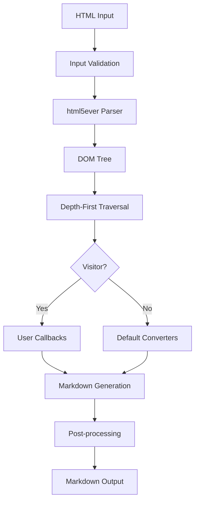
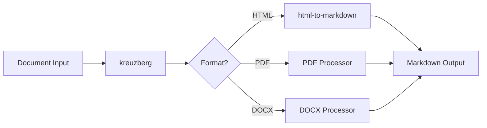

# Architecture

html-to-markdown is a high-performance HTML to Markdown converter built with a **Rust core** and **polyglot bindings** across 11 language ecosystems. This page describes the overall architecture, the FFI layer, and how each binding connects to the core engine.

---

## Rust Core Engine

The core conversion engine lives in the `crates/html-to-markdown` crate. It is responsible for:

- **HTML parsing** via [html5ever](https://crates.io/crates/html5ever), the same parser used by Mozilla Servo
- **DOM traversal** with depth-first walking of the parsed tree
- **Markdown generation** with configurable output styles
- **Metadata extraction** (titles, headers, links, images, structured data)
- **Visitor pattern** for user-defined conversion customization
- **Input validation** and UTF-16 recovery
- **Text wrapping** and whitespace normalization



### Crate Layout

| Crate | Purpose |
|-------|---------|
| `crates/html-to-markdown` | Core library with all conversion logic |
| `crates/html-to-markdown-ffi` | C FFI layer via cbindgen |
| `crates/html-to-markdown-cli` | Command-line interface |
| `crates/html-to-markdown-node` | NAPI-RS bindings for Node.js |
| `crates/html-to-markdown-py` | PyO3 bindings for Python |
| `crates/html-to-markdown-php` | ext-php-rs bindings for PHP |
| `crates/html-to-markdown-wasm` | wasm-bindgen bindings for WASM |
| `crates/html-to-markdown-bindings-common` | Shared binding utilities |

---

## FFI Layer

The Foreign Function Interface layer enables all non-Rust bindings to call into the core engine. The approach varies by language ecosystem.

### C Header Generation (cbindgen)

The `crates/html-to-markdown-ffi` crate uses [cbindgen](https://github.com/mozilla/cbindgen) to auto-generate a stable C header (`html_to_markdown.h`) from Rust source code. This header defines:

- Opaque pointers to Rust structs
- `extern "C"` function signatures for conversion APIs
- Callback types for the visitor pattern
- Memory management functions (`html_to_markdown_free_string`)

```
Rust Source (crates/ffi/src/lib.rs)
        |
        v
    cbindgen
        |
        v
C Header (html_to_markdown.h)
        |
        +---> Go (CGO)
        +---> Java (JNI)
        +---> C# (P/Invoke)
```

!!! info "ABI Stability"
    The C API follows semantic versioning. Struct layouts and function signatures are frozen within a major version. All exported functions use `#[no_mangle]` with `extern "C"` and `#[repr(C)]` structs for cross-platform ABI compatibility.

### Direct Rust Bindings

Several language bindings bypass the C FFI layer entirely, using Rust-native binding frameworks that compile directly against the core crate:

| Framework | Language | Mechanism |
|-----------|----------|-----------|
| [PyO3](https://pyo3.rs) | Python | Compiles Rust into a native Python extension module (.so/.pyd) |
| [NAPI-RS](https://napi.rs) | Node.js / Bun | Compiles Rust into a native Node addon (.node) |
| [Magnus](https://github.com/matsadler/magnus) | Ruby | Compiles Rust into a native Ruby extension (.so/.bundle) |
| [ext-php-rs](https://github.com/davidcole1340/ext-php-rs) | PHP | Compiles Rust into a PHP extension (.so/.dll) |
| [wasm-bindgen](https://rustwasm.github.io/wasm-bindgen/) | WASM | Compiles Rust to WebAssembly (.wasm) with JS glue |
| [Rustler](https://github.com/rusterlium/rustler) | Elixir | Compiles Rust into an Erlang NIF |
| [extendr](https://extendr.github.io/extendr/) | R | Compiles Rust into an R native extension |

---

## Binding Architecture

### Python (PyO3)

The Python binding in `crates/html-to-markdown-py` uses PyO3 to expose a native Python module. Key functions (`convert`, `convert_with_metadata`, `convert_with_visitor`) are thin wrappers that translate Python types to Rust and back. Async visitor support bridges Python's `asyncio` with Tokio.

```
Python code
    |
    v
PyO3 wrapper (crates/html-to-markdown-py)
    |
    v
Rust core (crates/html-to-markdown)
```

### Node.js / TypeScript (NAPI-RS)

The TypeScript binding uses NAPI-RS to compile a native `.node` addon. The `packages/typescript` directory provides TypeScript type definitions and the npm package. Both synchronous and Promise-based async visitor APIs are supported.

### Ruby (Magnus)

Magnus generates a native Ruby extension that loads into the Ruby runtime. The `packages/ruby` gem wraps the extension with a clean Ruby API including keyword arguments and symbol-based options.

### PHP (ext-php-rs)

The PHP binding compiles to a PHP extension via ext-php-rs. The `packages/php` directory provides a Composer package with typed interfaces. A PIE package in `packages/php-ext` handles distribution.

### WASM (wasm-bindgen)

The WASM binding compiles the core to WebAssembly, supporting browser, Node.js, Deno, and Cloudflare Workers environments. The binding uses `wasm-pack` for building and publishes to npm as `@kreuzberg/html-to-markdown-wasm`.

### Go (CGO)

The Go binding in `packages/go` uses CGO to call into the C FFI layer. It provides a Go-native API with standard error handling patterns.

### Java (JNI)

The Java binding in `packages/java` uses JNI to load the compiled FFI shared library. It provides a static `HtmlToMarkdown.convert()` method with Java-style exception handling.

### C# (P/Invoke)

The C# binding in `packages/csharp` uses P/Invoke to call the C FFI functions. It ships as a NuGet package with a managed wrapper around the native library.

### Elixir (Rustler)

The Elixir binding uses Rustler NIFs compiled from `packages/elixir/native`. It follows Elixir conventions with `{:ok, result}` / `{:error, reason}` return tuples and a `use HtmlToMarkdown.Visitor` macro for the visitor pattern.

### R (extendr)

The R binding uses extendr to compile a native R extension from `packages/r/src/rust`. It provides `convert()`, `convert_with_metadata()`, and `convert_with_visitor()` functions following R naming conventions.

---

## Integration with kreuzberg

[kreuzberg](https://docs.kreuzberg.dev) is a document intelligence library that uses html-to-markdown internally for HTML conversion. When kreuzberg processes HTML documents (from web scraping, email parsing, or document extraction), it delegates to html-to-markdown's Rust core for the HTML-to-Markdown conversion step.



!!! tip "Using both libraries"
    If you need full document intelligence (PDF, DOCX, images, etc.), use [kreuzberg](https://docs.kreuzberg.dev). If you only need HTML to Markdown conversion, use html-to-markdown directly for maximum performance and minimal dependencies.

---

## Feature Flags

The core crate uses Cargo feature flags to control compilation:

| Feature | Default | Description |
|---------|---------|-------------|
| `metadata` | Yes | Metadata extraction (`convert_with_metadata`) |
| `visitor` | Yes | Synchronous visitor pattern support |
| `async-visitor` | Yes | Async visitor support (requires Tokio) |
| `inline-images` | Yes | Inline image extraction from data URIs and SVGs |
| `serde` | Yes | JSON serialization/deserialization for options |

Disabling unused features reduces binary size and compilation time, which is particularly relevant for WASM builds where bundle size matters.
