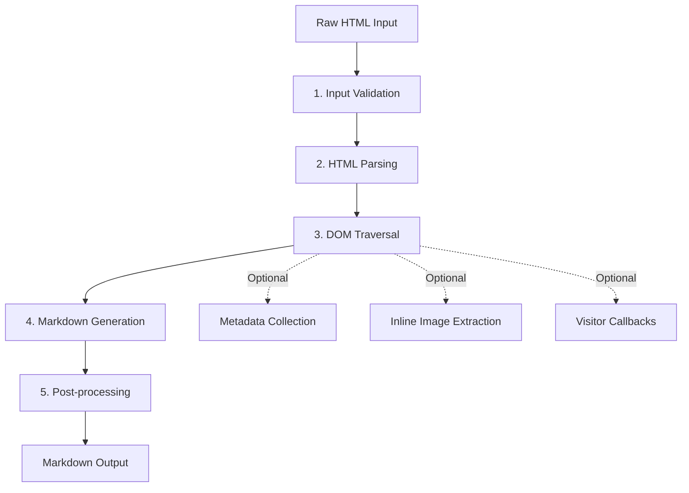
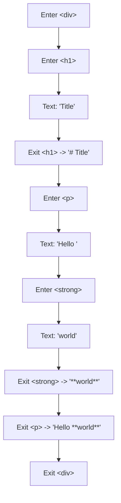

# Conversion Pipeline

html-to-markdown processes HTML through a multi-stage pipeline that parses, traverses, generates, and post-processes Markdown output. This page explains each stage in detail.

---

## Pipeline Overview

---

## Stage 1: Input Validation

Before any parsing begins, the input passes through validation and normalization.

**Validation checks:**

- Rejects binary data (PDF magic bytes, high null-byte density)
- Detects and recovers UTF-16 encoded input (both LE and BE, with or without BOM)
- Strips stray NUL bytes from malformed inputs

**Normalization:**

- Converts CRLF (`\r\n`) and bare CR (`\r`) line endings to LF (`\n`)
- Decodes UTF-16 to UTF-8 when detected

!!! note "Fast path for plain text"
    If the input contains no angle brackets (`<`), the parser is bypassed entirely. The text is HTML-entity-decoded, whitespace-normalized, and returned directly. This fast path avoids the overhead of building a DOM tree for non-HTML content.

---

## Stage 2: HTML Parsing (html5ever)

The validated input is parsed into a DOM tree using [html5ever](https://crates.io/crates/html5ever), the same HTML5-compliant parser used by Mozilla's Servo browser engine.

**Key characteristics:**

- **Standards-compliant**: Implements the full [WHATWG HTML5 parsing specification](https://html.spec.whatwg.org/multipage/parsing.html), handling malformed HTML exactly as browsers do
- **Error recovery**: Automatically fixes unclosed tags, mismatched nesting, and other common HTML issues
- **Streaming**: Parses input incrementally without requiring the entire document in memory
- **Zero-copy where possible**: Minimizes string allocations during parsing

The parser produces an `RcDom` tree structure where each node represents an HTML element, text node, comment, or document fragment.

---

## Stage 3: DOM Traversal

The DOM tree is walked using **depth-first traversal**. Each node is visited in document order, with the traversal engine handling:

**Element classification:**

- **Block elements** (`
`, `
`, `<h1>`-`<h6>`, `<blockquote>`, `<table>`, `<ul>`, `<ol>`, `<pre>`, etc.) - generate paragraph breaks and structural Markdown
- **Inline elements** (`<strong>`, `<em>`, `<code>`, `<a>`, ``, ``, etc.) - generate inline Markdown formatting
- **Void elements** (` `, `
`, ``) - generate specific Markdown tokens
- **Ignored elements** (`<script>`, `<style>`, `<noscript>`) - skipped entirely
- **Stripped elements** (user-configurable via `strip_tags`) - text content extracted, tags removed

**During traversal:**

1. **Enter element**: Determine element type and begin collecting child content
2. **Process children**: Recursively traverse child nodes
3. **Exit element**: Generate Markdown output based on element type and collected content
4. **Collect metadata**: If metadata extraction is enabled, gather headers, links, images, and structured data in a single pass
5. **Invoke visitor**: If a visitor is provided, call the appropriate callback for the element type

---

## Stage 4: Markdown Generation

Each element type has a dedicated converter that transforms the HTML element and its processed children into Markdown syntax.

### Headings

Headings support three styles controlled by the `heading_style` option:

| Style | Example |
|-------|---------|
| ATX (default) | `# Heading 1` |
| ATX Closed | `# Heading 1 #` |
| Underlined (Setext) | `Heading 1` followed by `=========` |

### Lists

List generation handles:

- Ordered (`<ol>`) and unordered (`<ul>`) lists
- Configurable bullet markers (`-`, `*`, `+`, or cycling through levels)
- Configurable indentation width (default 2 spaces)
- Nested list indentation
- List items with complex content (paragraphs, code blocks, nested lists)

### Code Blocks

Code blocks support fenced (backticks or tildes) and indented styles:

- Language detection from `class="language-*"` attributes on `<code>` elements
- Configurable default language via `code_language` option
- Proper handling of nested code fences

### Tables

Table conversion produces GitHub Flavored Markdown (GFM) tables with:

- Header row detection from `<thead>` or first `<tr>` with `<th>` elements
- Column alignment from `text-align` styles
- Cell content escaping (pipes, line breaks)
- Optional ` ` preservation in cells via `br_in_tables`

### Links and Images

- Standard links: `[text](url "title")`
- Autolinks: `<url>` when text matches URL and `autolinks` is enabled
- Images: ``
- Optional image skipping via `skip_images`

### Other Elements

| HTML | Markdown |
|------|----------|
| `<strong>`, `<b>` | `**text**` |
| `<em>`, `<i>` | `*text*` |
| `<del>`, `<s>` | `~~text~~` |
| `<mark>` | `==text==` (configurable) |
| `<blockquote>` | `> text` |
| `
` | `---` |
| ` ` | `\` or two trailing spaces |
| `` | Configurable symbol wrapping |
| `` | Configurable symbol wrapping |

---

## Stage 5: Post-processing

After Markdown generation, the output goes through final cleanup:

### Whitespace Normalization

- Collapses excessive blank lines (3+ consecutive newlines reduced to 2)
- Trims trailing whitespace from lines
- Ensures the document ends with a single newline

### Text Wrapping

When `wrap: true` is enabled, paragraphs and other block-level text content are wrapped at the configured `wrap_width` (default 80 columns). The wrapper respects:

- Markdown syntax boundaries (does not break inside links, emphasis, or code spans)
- Indentation levels (blockquotes, list items)
- Preformatted blocks (code blocks are never wrapped)

### Character Escaping

Configurable escaping prevents accidental Markdown formatting:

- `escape_asterisks`: Escapes `*` characters
- `escape_underscores`: Escapes `_` characters
- `escape_misc`: Escapes `\`, `&`, `<`, `` ` ``, `[`, `>`, `~`, `#`, `=`, `+`, `|`, `-`
- `escape_ascii`: Escapes all ASCII punctuation (for strict CommonMark compliance)

---

## Single-Pass Efficiency

A key design principle of the pipeline is that metadata extraction, inline image collection, and visitor callbacks all happen during the same traversal pass. There is no second pass over the DOM tree. This means:

- Converting with metadata has near-zero overhead compared to plain conversion
- Visitor callbacks are invoked inline during traversal, not in a separate phase
- Memory usage stays proportional to tree depth, not document size

!!! tip "Performance"
    For detailed benchmarks and optimization strategies, see the [Performance](performance.md) page.
