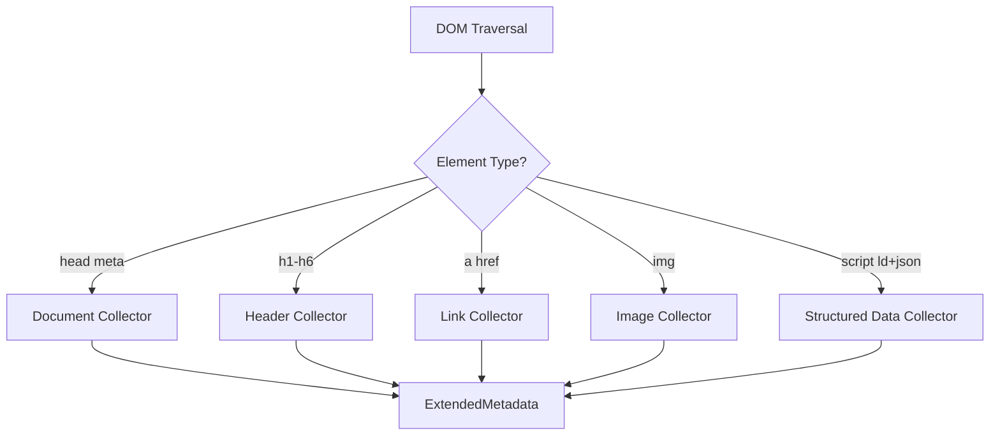

# Metadata Extraction <span class="version-badge">v2.13.0</span>

html-to-markdown can extract structured metadata from HTML documents during conversion, all in a single pass over the DOM tree. This is useful for SEO analysis, content indexing, table-of-contents generation, link validation, and content migration workflows.

---

## What Metadata Is Extracted

The `convert_with_metadata()` API returns both the converted Markdown and an `ExtendedMetadata` object containing five categories of structured data.

### Document Metadata

Top-level information about the HTML document:

| Field | Source | Example |
|-------|--------|---------|
| `title` | `<title>` tag | `"My Blog Post"` |
| `description` | `<meta name="description">` | `"A guide to..."` |
| `author` | `<meta name="author">` | `"Jane Doe"` |
| `language` | `<html lang="...">` | `"en"` |
| `direction` | `<html dir="...">` | `"ltr"` |
| `charset` | `<meta charset="...">` | `"utf-8"` |
| `open_graph` | `<meta property="og:*">` | `{"title": "...", "image": "..."}` |
| `twitter_card` | `<meta name="twitter:*">` | `{"card": "summary_large_image"}` |

### Headers

All heading elements (`<h1>` through `<h6>`) with their hierarchy:

| Field | Description |
|-------|-------------|
| `level` | Heading level (1-6) |
| `text` | Text content of the heading |
| `id` | The `id` attribute, if present |

### Links

All hyperlinks (`<a>` elements) classified by type:

| Link Type | Description | Example |
|-----------|-------------|---------|
| `External` | Links to other domains | `https://example.com/page` |
| `Internal` | Relative paths within the same site | `/about`, `../contact` |
| `Anchor` | Fragment-only links | `#section-id` |
| `Email` | `mailto:` links | `mailto:user@example.com` |
| `Phone` | `tel:` links | `tel:+1234567890` |

Each link includes `href`, `text`, `title`, `rel` attributes, and the classified `link_type`.

### Images

All image elements (``) with metadata:

| Field | Description |
|-------|-------------|
| `src` | Image source URL |
| `alt` | Alt text |
| `title` | Title attribute |
| `image_type` | `External`, `DataUri`, or `Inline` |
| `width` | Width attribute, if present |
| `height` | Height attribute, if present |

### Structured Data

Machine-readable data embedded in the HTML:

| Type | Source |
|------|--------|
| JSON-LD | `<script type="application/ld+json">` blocks |
| Microdata | Elements with `itemscope`, `itemprop`, `itemtype` attributes |
| RDFa | Elements with `typeof`, `property`, `about` attributes |

Each entry includes the `data_type`, raw `content`, and the `schema_type` when identifiable.

---

## How It Works

Metadata extraction happens during the same DOM traversal pass as Markdown generation. The conversion engine maintains a `MetadataCollector` that listens for relevant elements:



!!! info "Zero overhead when disabled"
    Metadata collection adds near-zero overhead to conversion. When specific extraction categories are disabled in `MetadataConfig`, those collectors are not invoked at all.

### MetadataConfig

Control which categories of metadata to extract:

| Field | Default | Description |
|-------|---------|-------------|
| `extract_document` | `true` | Extract document-level meta tags |
| `extract_headers` | `true` | Extract heading elements |
| `extract_links` | `true` | Extract hyperlinks |
| `extract_images` | `true` | Extract image elements |
| `extract_structured_data` | `true` | Extract JSON-LD, Microdata, RDFa |
| `max_structured_data_size` | `100000` | Maximum bytes for structured data (prevents memory exhaustion from large JSON-LD blocks) |

---

## Use Cases

### SEO Analysis

Extract document metadata, Open Graph tags, and structured data to audit SEO health:

```
Title: "Product Page"
Description: "Buy our product..."
OG Image: "https://cdn.example.com/product.jpg"
Structured Data: Product schema with price, availability
Headers: H1 count (should be exactly 1)
```

### Table of Contents Generation

Use extracted headers to build a table of contents:

```
## Table of Contents
- [Introduction](#introduction)       (h1)
  - [Background](#background)         (h2)
  - [Methodology](#methodology)       (h2)
    - [Data Collection](#data)         (h3)
- [Results](#results)                  (h1)
```

### Link Validation

Audit all links in a document:

- Identify broken external links
- Find orphaned anchor links (fragment targets that do not exist)
- Catalog all internal navigation paths
- Flag `mailto:` and `tel:` links for review

### Content Migration

When migrating content between CMS platforms, metadata extraction helps:

- Map document titles and descriptions to the new system's fields
- Rewrite internal links to match the new URL structure
- Inventory all images for asset migration
- Preserve structured data for search engine continuity

### Accessibility Auditing

Check image alt text coverage, heading hierarchy, and link text quality:

```
Images without alt text: 3 of 15
Heading hierarchy violations: H3 after H1 (skipped H2)
Links with "click here" text: 2
```

---

## API Overview

The metadata API is available in most language bindings. The function signatures follow each language's conventions, but the data structures are consistent.

=== "Rust"

    ```rust
    use html_to_markdown_rs::{convert_with_metadata, MetadataConfig};

    let html = r#"<html lang="en"><head><title>Test</title></head>
                   <body><h1>Hello</h1></body></html>"#;

    let config = MetadataConfig::default();
    let (markdown, metadata) = convert_with_metadata(html, None, config, None)?;

    println!("Title: {:?}", metadata.document.title);
    println!("Headers: {}", metadata.headers.len());
    ```

=== "Python"

    --8<-- "docs/snippets/python/metadata/basic_extraction.md"

=== "TypeScript"

    --8<-- "docs/snippets/typescript/metadata/basic_extraction.md"

=== "Ruby"

    --8<-- "docs/snippets/ruby/metadata/basic_extraction.md"

=== "PHP"

    --8<-- "docs/snippets/php/metadata/basic_extraction.md"

For complete metadata extraction guides with full code examples, see [Metadata Extraction Guide](../guides/metadata.md).

---

## Further Reading

- [Metadata Extraction Guide](../guides/metadata.md) -- step-by-step guide with language-specific examples
- [Conversion Pipeline](conversion-pipeline.md) -- how metadata collection fits into the pipeline
- [kreuzberg integration](https://docs.kreuzberg.dev) -- document intelligence with metadata extraction at scale
