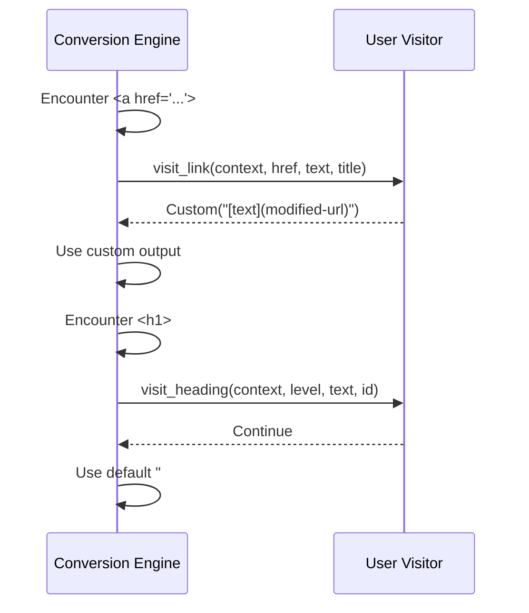

# Visitor Pattern <span class="version-badge new">v2.23.0</span>

The visitor pattern allows you to customize how specific HTML elements are converted to Markdown. Instead of modifying the library itself, you provide callback functions that intercept elements during conversion and return custom output.

---

## What Is the Visitor Pattern?

In html-to-markdown, a **visitor** is an object (or set of callbacks) that receives notifications as the conversion engine encounters HTML elements. For each element type, you can implement a handler that decides what to do:

- **Continue** -- use the default conversion logic
- **Custom** -- replace the default output with your own Markdown
- **Skip** -- omit the element entirely from output
- **Preserve HTML** -- keep the raw HTML in the Markdown output

This gives you fine-grained control over conversion behavior without forking the library or writing a full converter from scratch.

---

## How It Works in html-to-markdown

During [DOM traversal](conversion-pipeline.md#stage-3-dom-traversal), the conversion engine checks whether a visitor is registered. When an element matches a visitor callback, the engine:

1. Builds a **NodeContext** with element metadata (tag name, attributes, depth, parent info)
2. Calls the appropriate visitor method (e.g., `visit_link`, `visit_heading`, `visit_image`)
3. Inspects the return value to determine output behavior
4. Falls back to default conversion if no callback is registered for that element type



### Visit Result Types

Every visitor callback returns one of these result types:

| Result | Behavior |
|--------|----------|
| `Continue` | Proceed with the default conversion for this element |
| `Custom(markdown)` | Replace the element's output with the provided Markdown string |
| `Skip` | Remove the element entirely from output |
| `PreserveHtml` | Include the raw HTML verbatim in the Markdown |
| `Error(reason)` | Stop conversion and return an error |

### NodeContext

All visitor callbacks receive a context object with metadata about the current element:

| Field | Type | Description |
|-------|------|-------------|
| `node_type` | enum | Coarse classification (link, heading, image, etc.) |
| `tag_name` | string | Raw HTML tag name (`a`, `h1`, `img`, etc.) |
| `attributes` | map | HTML attributes as key-value pairs |
| `depth` | integer | Nesting depth in the DOM tree |
| `index_in_parent` | integer | Zero-based sibling index |
| `parent_tag` | string/null | Parent element's tag name |
| `is_inline` | boolean | Whether the element is treated as inline |

---

## Support Matrix

Not all language bindings support the visitor pattern. The table below shows current support:

| Binding | Visitor | Async Visitor | Best For |
|---------|---------|---------------|----------|
| **Rust** | Yes | Yes (Tokio) | Core library, maximum performance |
| **Python** | Yes | Yes (asyncio) | Server-side processing, data pipelines |
| **TypeScript** | Yes | Yes (Promise) | Node.js / Bun server-side, SSR |
| **Ruby** | Yes | No | Rails, Sinatra, content management |
| **PHP** | Yes | No | WordPress, Laravel, CMS platforms |
| **Elixir** | Yes | No | Phoenix, high-concurrency services |
| **R** | No | -- | Statistical analysis, basic conversion |
| **C** | Yes | No | Embedded, system-level integration |
| **Go** | No | -- | Basic conversion, microservices |
| **Java** | No | -- | Basic conversion, enterprise apps |
| **C#** | No | -- | Basic conversion, .NET applications |
| **WASM** | No | -- | Browser/edge, Cloudflare Workers |

!!! note "Async visitor support"
    Async visitors allow callback functions to perform I/O operations (HTTP requests, database lookups, file reads) during conversion. They are available in Python (via `asyncio`), TypeScript (via `Promise`), and Rust (via `Tokio`).

---

## Available Callbacks

Visitor implementations can override any combination of these callbacks. Unimplemented callbacks default to `Continue` (standard conversion).

### Text and Formatting

| Callback | HTML Element(s) |
|----------|----------------|
| `visit_text` | Text nodes |
| `visit_strong` | `<strong>`, `<b>` |
| `visit_emphasis` | `<em>`, `<i>` |
| `visit_strikethrough` | `<s>`, `<del>`, `<strike>` |
| `visit_underline` | `<u>`, `<ins>` |
| `visit_subscript` | `<sub>` |
| `visit_superscript` | `<sup>` |
| `visit_mark` | `<mark>` |

### Links and Media

| Callback | HTML Element(s) |
|----------|----------------|
| `visit_link` | `<a>` |
| `visit_image` | `` |
| `visit_audio` | `<audio>` |
| `visit_video` | `<video>` |
| `visit_iframe` | `<iframe>` |

### Code

| Callback | HTML Element(s) |
|----------|----------------|
| `visit_code_block` | `<pre><code>` |
| `visit_code_inline` | `<code>` |

### Structure

| Callback | HTML Element(s) |
|----------|----------------|
| `visit_heading` | `<h1>` through `<h6>` |
| `visit_blockquote` | `<blockquote>` |
| `visit_horizontal_rule` | `<hr>` |
| `visit_line_break` | `<br>` |

### Lists

| Callback | HTML Element(s) |
|----------|----------------|
| `visit_list_start` | `<ul>`, `<ol>` |
| `visit_list_item` | `<li>` |
| `visit_list_end` | End of `<ul>`, `<ol>` |

### Tables

| Callback | HTML Element(s) |
|----------|----------------|
| `visit_table_start` | `<table>` |
| `visit_table_row` | `<tr>` |
| `visit_table_end` | End of `<table>` |

### Generic Hooks

| Callback | Description |
|----------|-------------|
| `visit_element_start` | Called before entering any element |
| `visit_element_end` | Called after exiting any element |
| `visit_custom_element` | Web components or unknown tags |

---

## Common Use Cases

### Content Filtering

Remove unwanted elements from conversion output:

```
visit_image -> Skip          # Remove all images
visit_link  -> Custom(text)  # Strip links, keep text
```

### URL Rewriting

Transform URLs during conversion (e.g., converting relative paths to absolute, adding tracking parameters, or switching CDN domains):

```
visit_link(ctx, href, text, title):
    new_url = rewrite(href)
    return Custom("[{text}]({new_url})")
```

### Domain-Specific Dialects

Generate non-standard Markdown for specific platforms:

- **Slack/Discord**: Custom emoji syntax, mention formatting
- **Confluence**: Wiki-style links and macros
- **Obsidian**: Internal link syntax `[[page]]`
- **MDX**: JSX component embedding

### Content Enrichment

Add metadata or annotations during conversion:

```
visit_heading(ctx, level, text, id):
    anchor = generate_anchor(text)
    return Custom("#{level} {text} {{#{anchor}}}")
```

### Security Filtering

Sanitize or rewrite potentially dangerous content:

```
visit_link(ctx, href, text, title):
    if is_javascript_url(href):
        return Skip
    return Continue
```

---

## Further Reading

- [Visitor Pattern Guide](../guides/visitor.md) -- step-by-step implementation guide with code examples
- [Conversion Pipeline](conversion-pipeline.md) -- how visitors fit into the overall pipeline
- [Configuration Options](../guides/configuration.md) -- non-visitor configuration options
